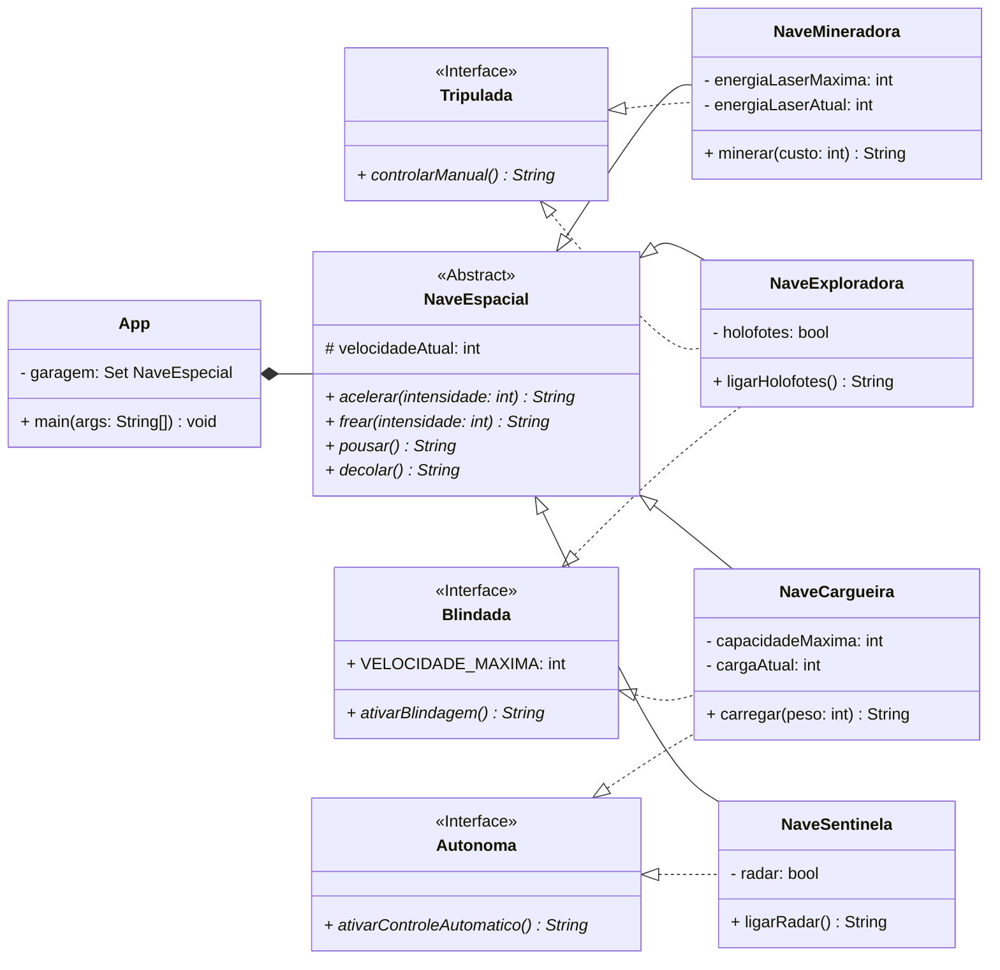

## Lista 4

## Diagrama de Classes

```mermaid

classDiagram
    
    direction LR
    
    class App {
        - garagem: Set NaveEspecial
        + main(args: String[]) void
    }
    
    class NaveEspacial {
            <<Abstract>>
        # velocidadeAtual: int
        
        + acelerar(intensidade: int) String *
        + frear(intensidade: int) String *
        + pousar() String *
        + decolar() String *
    }
    
    class NaveMineradora {
        - energiaLaserMaxima: int
        - energiaLaserAtual: int
        
        + minerar(custo: int) String
    }
    
    class NaveExploradora {
        - holofotes: bool
        + ligarHolofotes() String
    }
    
    class NaveCargueira {
        - capacidadeMaxima: int
        - cargaAtual: int
        + carregar(peso: int) String
    }
    
    class NaveSentinela {
        - radar: bool
        + ligarRadar() String
    }
    
    class Tripulada {
        <<Interface>>
        + controlarManual() String *
    }
    
    class Blindada {
        <<Interface>>
        
        + VELOCIDADE_MAXIMA: int
        
        + ativarBlindagem() String *
    }
    
    class Autonoma {
        <<Interface>>
        + ativarControleAutomatico() String *
    }
    
    
    
    
    
    App *-- NaveEspacial
    
    NaveEspacial <|-- NaveMineradora 
    NaveEspacial <|-- NaveExploradora
    NaveEspacial <|-- NaveCargueira
    NaveEspacial <|-- NaveSentinela

    Tripulada <|.. NaveMineradora
    Tripulada <|.. NaveExploradora
    Blindada <|.. NaveExploradora
    Blindada <|.. NaveCargueira
    Autonoma <|.. NaveCargueira
    Autonoma <|.. NaveSentinela
        
    


```

